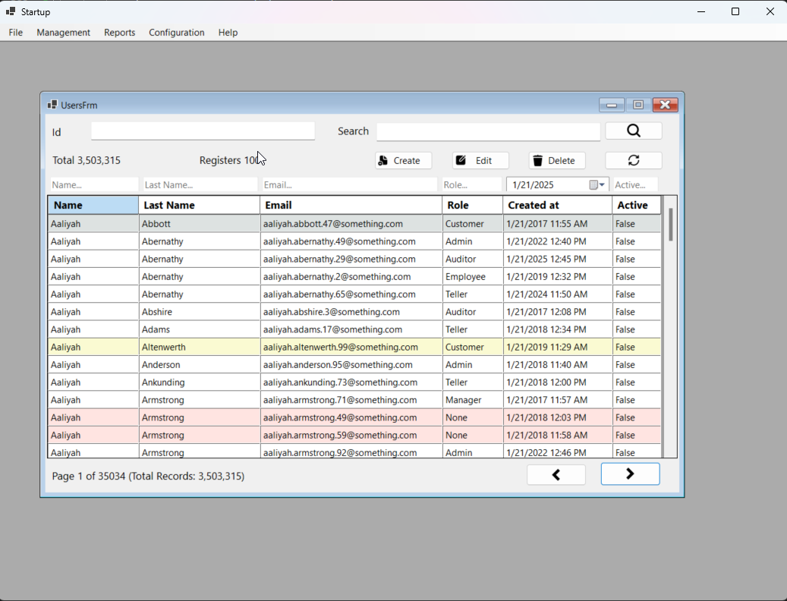
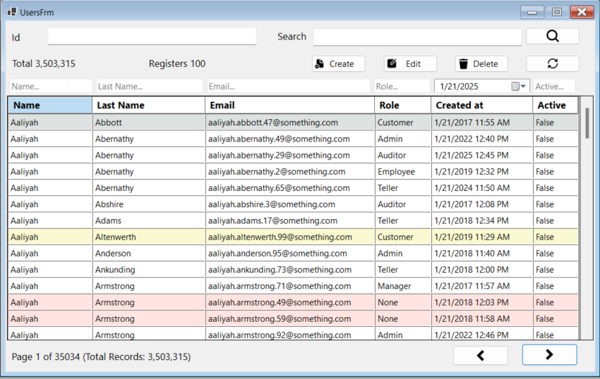
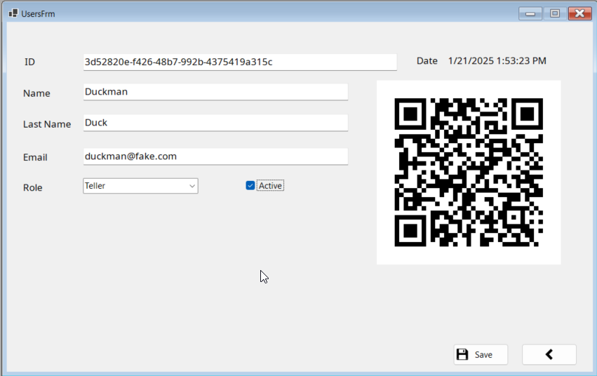

# corebanking-manticorecapital-winforms-csharp
corebanking-manticorecapital-winforms-csharp


Este proyecto es una aplicación monolítica desarrollada con **WinForms** en **.NET 8**, que implementa **DDD (Domain-Driven Design)**, **CQRS**, y utiliza herramientas como **ADO.NET**, **Dapper**, **Procedimientos Almacenados (SP)** e **IoC (Inversión de Control)**.

---

## 🛠 Tecnologías y Herramientas Utilizadas

- **Lenguaje:** C# (.NET 8)
- **Patrones de Diseño:**
  - CQRS (Command Query Responsibility Segregation)
  - DDD (Domain-Driven Design)
- **Base de Datos:** SQL Server
  - Acceso a datos con ADO.NET y Dapper
  - Uso de Procedimientos Almacenados (Stored Procedures)
- **UI:** WinForms
- **Gestión de Dependencias:** IoC (Inversión de Control)

---

## 📁 Estructura del Proyecto

El proyecto está dividido en las siguientes capas:

### 1. **Manticorecapital.Application**
   - Contiene la lógica de aplicación, incluyendo los casos de uso y la implementación de **CQRS**.
   - Subcarpetas:
     - `Clientes`: Casos de uso relacionados con clientes.
     - `Facturas`: Casos de uso relacionados con facturas.
     - `Productos`: Casos de uso relacionados con productos.
     - `Ventas`: Casos de uso relacionados con ventas.

### 2. **Manticorecapital.Domain**
   - Define las **entidades** y las **interfaces** necesarias para la lógica de dominio.
   - Subcarpetas:
     - `Entities`: Entidades de dominio.
     - `Dependencies`: Interfaces del dominio.

### 3. **Manticorecapital.Infrastructure**
   - Implementa el acceso a datos y la lógica de infraestructura.
   - Subcarpetas:
     - `Database`: Configuración y acceso a la base de datos utilizando **ADO.NET** y **Dapper**.
     - `Repositories`: Implementaciones de los repositorios del dominio.
     - `Factories`: Factorías necesarias para crear objetos de infraestructura.
     - `IoC`: Configuración de Inversión de Control.

### 4. **Manticorecapital.Presentation**
   - Contiene la interfaz de usuario utilizando **WinForms**.
   - Subcarpetas:
     - `Forms`: Formularios individuales de la aplicación.
     - `Mdi`: Formularios principales para gestionar la interfaz MDI.
     - `Utils`: Utilidades compartidas en la capa de presentación.
     - `IoC`: Configuración específica de IoC para la presentación.

### 5. **Manticorecapital.Transversal**
   - Contiene dependencias y utilidades transversales reutilizables en todo el proyecto.
   - Subcarpetas:
     - `IoC`: Gestión y configuración de dependencias globales.

---

## ⚙️ Configuración

### 1. **Requisitos Previos**
   - .NET SDK 8 instalado.
   - SQL Server configurado.
   - Conexión a la base de datos configurada en el archivo `appsettings.json`.

### 2. **Configuración de la Base de Datos**
   - Asegúrate de ejecutar los scripts de los **procedimientos almacenados** en la base de datos.
   - Configura la cadena de conexión en `Manticorecapital.Presentation/appsettings.json`:
     ```json
     {
       "ConnectionStrings": {
         "DefaultConnection": "Server=YOUR_SERVER;Database=YOUR_DATABASE;User Id=YOUR_USER;Password=YOUR_PASSWORD;"
       }
     }
     ```

### 3. **Ejecutar el Proyecto**
   1. Abre la solución en Visual Studio 2022 o superior.
   2. Establece `Manticorecapital.Presentation` como proyecto de inicio.
   3. Compila y ejecuta el proyecto.

---

## 🧩 Principios de Diseño

### **Domain-Driven Design (DDD)**
El proyecto sigue el enfoque **DDD**, que divide la lógica del negocio en las siguientes capas:
- **Dominio:** Contiene entidades y lógica de negocio pura.
- **Aplicación:** Define casos de uso específicos y coordina la lógica entre el dominio e infraestructura.
- **Infraestructura:** Se encarga del acceso a datos, integración con servicios externos, y repositorios.

### **CQRS**
Se implementa la segregación de comandos y consultas:
- **Comandos:** Operaciones que modifican el estado del sistema (crear, actualizar, eliminar).
- **Consultas:** Operaciones de solo lectura que obtienen información.

### **Mediator**
Se implmeneta junto con **CQRS**, permitiendo que los objetos se comuniquen entre sí a través de un mediador, en lugar de hacerlo directamente.

### **ID**
Se implementa para que los objetos reciban sus dependencias de una fuente externa.

---

## 📂 Funcionalidades Principales

- **Gestión de Clientes:** Crear, editar y consultar clientes.
- **Gestión de Facturas:** Registrar y listar facturas.
- **Gestión de Productos:** Agregar, actualizar y consultar productos.
- **Gestión de Ventas:** Registrar y consultar ventas.

---

## 📂 Nugets utilizados

- **AutoMapper:** Mapea objetos.
- **MediatR:** Comunicación entre objetos. 
- **Microsoft.Extensions.Configuration:** Abstracciones para configurar IConfiguration.
- **Microsoft.Extensions.DependencyInjection:** Acoplamiento flexible

## 🔨 Autor

Victor Cruz


## Arquitectura

**Domain-Driven-Desing DDD**
```plaintext
├───Banking
│   ├─── Application
│   │   ├───Dtos
│   │   ├───Interfaces
│   │   ├───IoC
│   │   ├───Main
│   │   └───Mapping
│   │   
│   ├─── Infrastructure
│   │   ├───Data
│   │   ├───Interfaces
│   │   ├───IoC
│   │   ├───Repositories
│   │   │   ├───AdoNet
│   │   │   └───Dapper
│   │   └───Ventas
│   │       ├───Commands
│   │       └───Queries
│   │
│   ├─── Domain
│   │   └───Entities
│   │
│   ├─── Presentation
│   │   └───Forms
│   │
│   ├─── Presentation
│   │   ├───Forms
│   │   ├───Mdi
│   │   └───Utils
│   │
│   └─── Transversal
│   │   ├───Common
│   │   ├───Interfaces
│   │   └───IoC
└───

```








# Generar datos masivos de prueba

Se generan datos de forma masiva con **Go**.

Se utiliza un script en **Go** para generar de forma masiva datos genericos con el fin de implementar el **Caseo de Uso** de millones de registros.

Paquete implementado para conectar **Go** a SQL Server e inyectar registros:

Librerias utilizadas:

- faker: para generar datos ficticios.
- rankd: para generar números aleatorios.
- fmt: para formatear cadenas.
- sql: para interacturas con bases de datos SQL.
- os: para manejar el sistema de archivos.
- time: para trabajar con fechas y horas.


Se define el tipo **Users** que contiene las mismas propiedades que la tabla en sql.
```
type Users struct {
	Id            string
	Name          string
	LastName      string
	Email         string
	PasswordHash  string
	Role          int16
	IsActive      bool
	CreatedAt     time.Time
	LastUpdatedAt time.Time
}
```

Se define la faunción para generar los usuarios.

- Utiliza la biblioteca **faker** para generar datos aleatorios como nombres, apellidos, emails.
- Genera un **UUUID** para el campo **Id**.
- Define un **Role** generando un número aleatorio entre 0 y 6.
- Devuelve una instanci de **Users**.

```
func generateUsers() Users {
	name := faker.FirstName()
	lastName := faker.LastName()
	email := strings.ToLower(name) + "." + strings.ToLower(lastName) + "@something.com"

	return Users{
		Id:            faker.UUIDHyphenated(),
		Name:          name,
		LastName:      lastName,
		Email:         email,
		PasswordHash:  faker.Password(),
		Role:          int16(rand.Intn(7)), 
		IsActive:      false,
		CreatedAt:     time.Now().AddDate(-rand.Intn(10), 0, 0),
		LastUpdatedAt: time.Now().AddDate(-rand.Intn(10), 0, 0),
	}
}
```

Generación de Usuarios.

- Genera 5,000,000 usuarios.
- Inyecta los usuarios en la base de datos.

```
	for i := 0; i < 5000000; i++ {
		user := generateUsers()

		_, err = db.Exec(`INSERT INTO Banking.Users (Id, Name, LastName, Email, PasswordHash, Role, IsActive, CreatedAt, LastUpdatedAt)
		                  VALUES (@Id, @Name, @LastName, @Email, @PasswordHash, @Role, @IsActive, @CreatedAt, @LastUpdatedAt)`,
			sql.Named("Id", user.Id),
			sql.Named("Name", user.Name),
			sql.Named("LastName", user.LastName),
			sql.Named("Email", user.Email),
			sql.Named("PasswordHash", user.PasswordHash),
			sql.Named("Role", user.Role),
			sql.Named("IsActive", user.IsActive),
			sql.Named("CreatedAt", user.CreatedAt),
			sql.Named("LastUpdatedAt", user.LastUpdatedAt),
		)

		if err != nil {
			log.Println("--; Error when injecting data:", err)
		}
	}
```